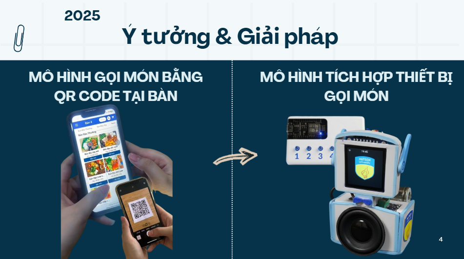
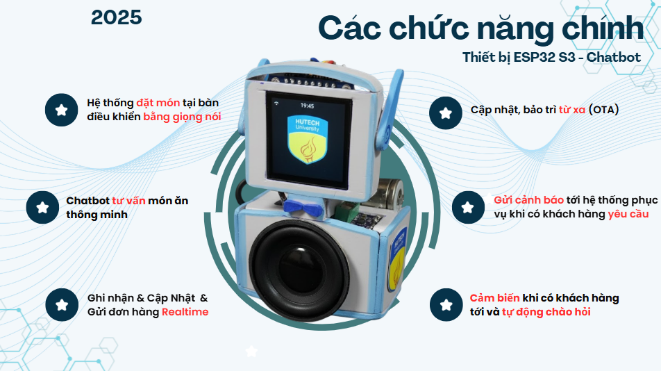
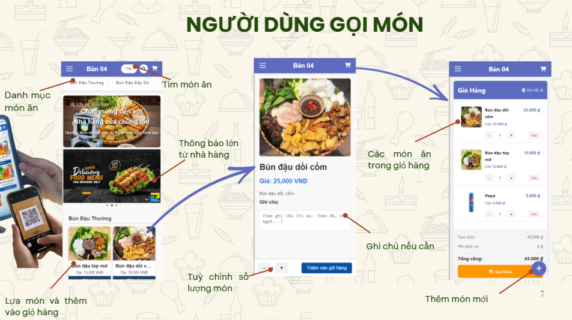
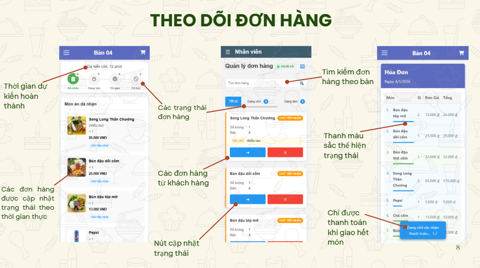
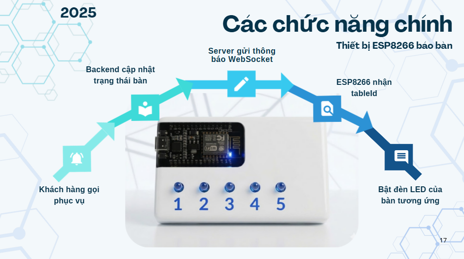
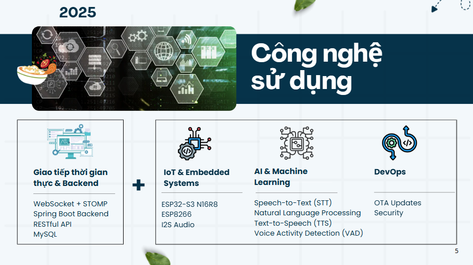
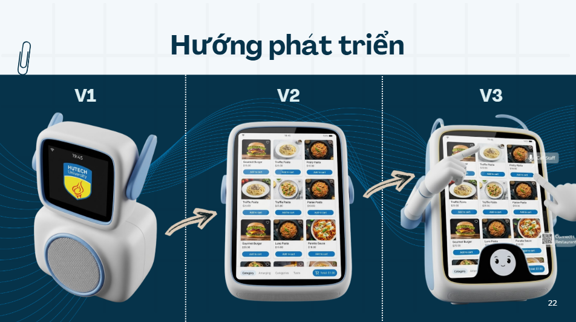

# Hệ Thống Gọi Món Tại Bàn Thông Minh

## 1. Tổng quan

Smart Table Ordering System là giải pháp dành cho nhà hàng, cho phép khách hàng gọi món trực tiếp tại bàn thông qua QR Code hoặc thiết bị IoT hỗ trợ giọng nói. Hệ thống giúp tối ưu quy trình phục vụ, giảm tải cho nhân viên và nâng cao trải nghiệm khách hàng.

---

## 2. Vấn đề

Quy trình gọi món truyền thống gặp nhiều hạn chế:

* Khách hàng phải chờ nhân viên ghi nhận đơn
* Dễ xảy ra sai sót khi ghi order
* Giao tiếp giữa bàn và bếp không hiệu quả
* Không có cập nhật trạng thái đơn hàng theo thời gian thực

---

## 3. Giải pháp

Hệ thống cung cấp:

* Gọi món qua QR Code hoặc thiết bị IoT tại bàn
* Hỗ trợ gọi món bằng giọng nói thông qua AI
* Đơn hàng được gửi trực tiếp đến bếp theo thời gian thực
* Nhân viên có thể theo dõi và quản lý đơn hàng dễ dàng

---

## 4. Tính năng chính
### Thiết bị ESP32 S3 - Chatbot

### Trang web gọi món tại bàn

* Gọi món bằng QR Code
* Tích hợp thiết bị IoT điều khiển bằng giọng nói
* Cập nhật đơn hàng real-time bằng WebSocket
* Xác thực và phân quyền (Admin, Staff)
* Quản lý menu và danh mục món
* Theo dõi trạng thái đơn hàng
* Gọi món bằng AI (tích hợp MCP)
* Tích hợp thanh toán online
* Gửi tính hiệu cảnh báo khẩn cấp

---

## 5. Kiến trúc hệ thống

Hệ thống gồm 3 thành phần chính:

### Backend

* RESTful API xây dựng bằng Spring Boot
* Bảo mật bằng JWT và phân quyền người dùng
* WebSocket cho giao tiếp thời gian thực

### Frontend

* Dashboard cho admin và nhân viên

### IoT

* Thiết bị thông minh (ESP32, tablet, ...)
* Nhận lệnh giọng nói và gửi về hệ thống

---

## 6. Công nghệ sử dụng

* Backend: Spring Boot, Spring Security, JWT
* Real-time: WebSocket
* Database: MySQL
* AI: Model Context Protocol (MCP)/ LLM DeepSeek
* IoT: ESP32 / thiết bị thông minh

---

## 7. Hướng phát triển

* Dashboard phân tích dữ liệu
* Hỗ trợ đa ngôn ngữ
* Phát triển mobile app cho khách hàng

---

Được phát triển bởi 
Đoàn Xuân Trường
doanxuantruong2110@gmail.com
