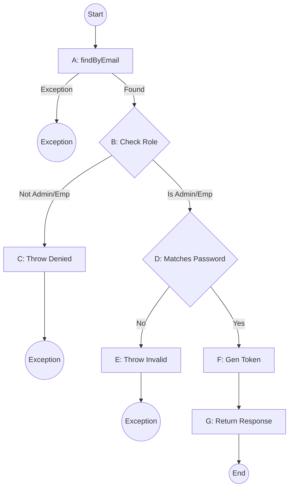
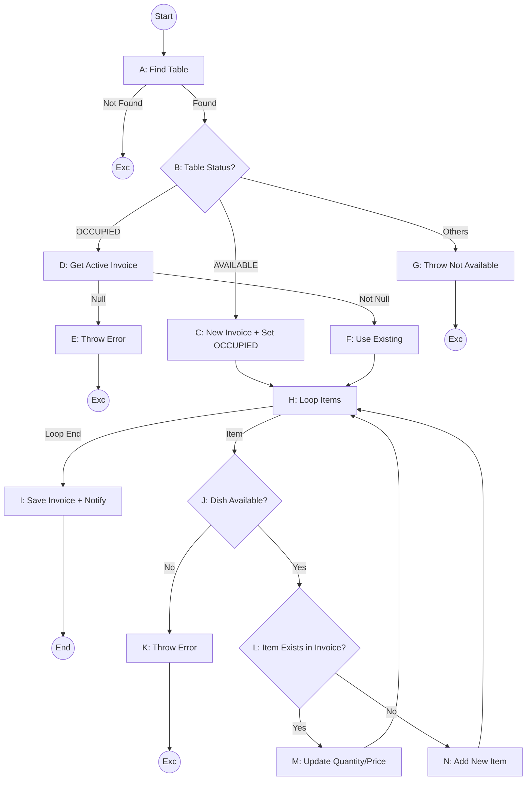

# CHƯƠNG 3. THIẾT KẾ TEST CASE

## 3.1. Phương pháp thiết kế test case

Trong chương này, hệ thống sẽ được kiểm thử thông qua hai phương pháp chính:
1. **Kiểm thử hộp đen (Black-box Testing):** Tập trung vào việc kiểm tra các chức năng của hệ thống mà không quan tâm đến cấu trúc bên trong của mã nguồn. Các kỹ thuật sử dụng bao gồm: Phân lớp tương đương, Phân tích giá trị biên và Kiểm thử dựa trên bảng quyết định.
2. **Kiểm thử hộp trắng (White-box Testing):** Tập trung vào cấu trúc logic bên trong của mã nguồn. Các kỹ thuật sử dụng bao gồm: Kiểm thử luồng điều khiển (Control Flow Testing), Phân tích đồ thị luồng (CFG) và tính toán độ phức tạp vòng (Cyclomatic Complexity).

## 3.2. Black-box Testing

Tổng số 50 Test Cases được thiết kế cho các module trọng tâm của hệ thống.

### 3.2.1. Phân lớp tương đương & Phân tích giá trị biên

Dưới đây là danh sách các test case chi tiết:

| STT | Module | Chức năng | Mô tả Test Case | Kết quả mong đợi |
|-----|--------|-----------|-----------------|------------------|
| 1 | Auth | Đăng nhập | Đăng nhập với Email và Password đúng | Đăng nhập thành công, chuyển đến Dashboard |
| 2 | Auth | Đăng nhập | Để trống trường Email | Thông báo lỗi: "Email không được để trống" |
| 3 | Auth | Đăng nhập | Nhập Email sai định dạng (thiếu @) | Thông báo lỗi: "Email không hợp lệ" |
| 4 | Auth | Đăng nhập | Sai mật khẩu | Thông báo lỗi: "Email hoặc mật khẩu không đúng" |
| 5 | Auth | Đăng nhập | Tài khoản không có quyền Admin/Employee | Thông báo lỗi: "Truy cập bị từ chối" |
| 6 | Auth | Đăng ký | Đăng ký với SĐT đã tồn tại | Thông báo lỗi: "Số điện thoại đã được sử dụng" |
| 7 | Auth | Đăng ký | Mật khẩu dưới 6 ký tự | Thông báo lỗi: "Mật khẩu phải từ 6 ký tự trở lên" |
| 8 | Auth | Refresh Token | Sử dụng token hết hạn để lấy token mới | Hệ thống cấp mới Access Token thành công |
| 9 | Menu | Tìm kiếm | Tìm kiếm món ăn bằng tên chính xác | Hiển thị đúng món ăn cần tìm |
| 10 | Menu | Tìm kiếm | Tìm kiếm không có kết quả | Hiển thị thông báo: "Không tìm thấy món ăn" |
| 11 | Menu | Lọc | Lọc món ăn theo danh mục (Đồ uống) | Chỉ hiển thị các món thuộc danh mục Đồ uống |
| 12 | Menu | Trạng thái | Kiểm tra món đã hết (Out of stock) | Nút "Thêm vào giỏ" bị vô hiệu hóa hoặc mờ |
| 13 | Menu | Hình ảnh | Kiểm tra load hình ảnh món ăn | Hình ảnh hiển thị rõ nét, không bị lỗi 404 |
| 14 | Menu | Chi tiết | Xem chi tiết món ăn | Hiển thị đầy đủ: Tên, giá, mô tả, thành phần |
| 15 | Giỏ hàng | Thêm món | Thêm 1 món vào giỏ hàng trống | Giỏ hàng hiển thị 1 món, tổng tiền cập nhật |
| 16 | Giỏ hàng | Thêm món | Thêm cùng 1 món nhiều lần | Số lượng món đó trong giỏ tăng lên |
| 17 | Giỏ hàng | Cập nhật | Tăng số lượng món trong giỏ | Số lượng và tổng tiền giỏ hàng tăng tương ứng |
| 18 | Giỏ hàng | Cập nhật | Giảm số lượng món về 0 | Món ăn tự động bị xóa khỏi giỏ hàng |
| 19 | Giỏ hàng | Xóa món | Xóa thủ công 1 món khỏi giỏ | Món bị xóa, tổng tiền giảm |
| 20 | Giỏ hàng | Lưu trữ | Refresh trang sau khi thêm món | Giỏ hàng vẫn giữ nguyên dữ liệu (LocalStorage) |
| 21 | Giỏ hàng | Ghi chú | Thêm ghi chú cho món ăn (ví dụ: Không cay) | Ghi chú được lưu cùng món ăn trong giỏ |
| 22 | Giỏ hàng | Giới hạn | Thêm số lượng món cực đại (999) | Hệ thống xử lý bình thường hoặc giới hạn hợp lý |
| 23 | Đặt món | Xác nhận | Nhấn "Đặt món" khi giỏ hàng trống | Nút đặt món bị ẩn hoặc báo lỗi "Giỏ hàng trống" |
| 24 | Đặt món | Bàn | Đặt món tại bàn chưa được quét mã QR | Yêu cầu người dùng quét mã QR hoặc chọn bàn |
| 25 | Đặt món | Quy trình | Đặt món thành công | Đơn hàng chuyển vào trạng thái "WAITING" (Chờ) |
| 26 | Đặt món | Realtime | Đặt món thành công | Tablet của nhân viên/bếp nhận thông báo ngay lập tức |
| 27 | Đặt món | Trạng thái | Đặt món khi món vừa hết trong kho | Thông báo lỗi: "Món ăn vừa hết, vui lòng cập nhật" |
| 28 | Đặt món | Lịch sử | Kiểm tra đơn hàng vừa đặt trong Lịch sử | Đơn hàng hiển thị đúng các món và tổng tiền |
| 29 | Đặt món | Hủy món | Hủy món khi bếp chưa chế biến | Hủy thành công, tổng tiền hóa đơn giảm |
| 30 | Đặt món | Hủy món | Hủy món khi bếp đang chế biến | Không cho phép hủy hoặc yêu cầu gọi nhân viên |
| 31 | Đặt món | Ghi chú | Kiểm tra ghi chú gửi tới bếp | Bếp nhìn thấy ghi chú đi kèm với món ăn |
| 32 | Đặt món | Cộng dồn | Đặt thêm món khi đang có hóa đơn mở | Món mới được cộng thêm vào hóa đơn hiện tại |
| 33 | Thanh toán | Momo | Chọn thanh toán qua Momo | Chuyển hướng sang trang/app thanh toán Momo |
| 34 | Thanh toán | Momo | Thanh toán Momo thành công | Trạng thái hóa đơn chuyển sang PAID, bàn trống |
| 35 | Thanh toán | Momo | Hủy thanh toán giữa chừng | Trạng thái hóa đơn vẫn là OPEN |
| 36 | Thanh toán | Tiền mặt | Yêu cầu thanh toán tiền mặt | Gửi thông báo gọi nhân viên tới thanh toán |
| 37 | Thanh toán | Tiền mặt | Nhân viên xác nhận đã thu tiền | Trạng thái hóa đơn chuyển sang PAID |
| 38 | Thanh toán | Hóa đơn | Kiểm tra tính chính xác của tổng tiền | Tổng tiền = Tổng (đơn giá * số lượng) các món |
| 39 | Quản lý bàn | Trạng thái | Chuyển trạng thái bàn sang "Cleaning" | Bàn hiển thị màu vàng/trạng thái đang dọn |
| 40 | Quản lý bàn | Trạng thái | Chuyển bàn "Cleaning" sang "Available" | Bàn hiển thị màu xanh, sẵn sàng đón khách |
| 41 | Quản lý bàn | QR Code | Quét mã QR tại bàn | Hệ thống nhận diện đúng số bàn tương ứng |
| 42 | Quản lý bàn | Đặt chỗ | Đặt trước bàn (Reservation) | Bàn chuyển sang trạng thái "Reserved" |
| 43 | Quản lý bàn | Gộp bàn | Thực hiện gộp 2 bàn | Đơn hàng của 2 bàn được gom về 1 hóa đơn chung |
| 44 | Quản lý bàn | Chuyển bàn | Chuyển đơn hàng từ bàn A sang bàn B | Dữ liệu hóa đơn được cập nhật sang bàn mới |
| 45 | Chat | Gửi tin | Khách hàng gửi tin nhắn cho nhân viên | Nhân viên nhận được tin nhắn realtime |
| 46 | Chat | Phản hồi | Nhân viên trả lời tin nhắn | Khách hàng nhận được phản hồi ngay lập tức |
| 47 | Chat | Trạng thái | Kiểm tra tin nhắn "Đã xem" | Hiển thị trạng thái tin nhắn đã được nhân viên đọc |
| 48 | Thông báo | Gọi NV | Khách hàng nhấn "Gọi nhân viên" | Tablet nhân viên rung/phát chuông báo |
| 49 | Thông báo | Bếp | Bếp báo "Món đã xong" | Khách hàng nhận thông báo món đang được bưng lên |
| 50 | Thông báo | Admin | Admin nhận thông báo khi có doanh thu mới | Dashboard Admin cập nhật số liệu ngay lập tức |

## 3.3. White-box Testing

Phần này tập trung phân tích cấu trúc mã nguồn của 4 hàm quan trọng nhất trong backend.

### 3.3.1. Module 1: AuthServiceImpl.login()

**Đoạn mã phân tích:**
```java
public LoginResponse login(LoginRequest loginRequest) {
    // 1. Tìm user theo email
    UserEntity user = userRepository.findByEmail(loginRequest.getEmail())
            .orElseThrow(() -> new BadRequestException("Invalid email or password")); // Node A

    // 2. Kiểm tra Role
    if (user.getRole() != Role.ADMIN && user.getRole() != Role.EMPLOYEE) { // Node B
        throw new BadRequestException("Access denied..."); // Node C
    }

    // 3. Kiểm tra Password
    if (!passwordEncoder.matches(loginRequest.getPassword(), user.getPassword())) { // Node D
        throw new BadRequestException("Invalid email or password"); // Node E
    }

    // 4. Thành công
    String token = generateTokenForUser(user); // Node F
    String refreshToken = UUID.randomUUID().toString();
    user.setRefreshToken(refreshToken);
    userRepository.save(user);

    return LoginResponse.builder()...build(); // Node G
}
```

**Vẽ Control Flow Graph (CFG):**



**Tính Cyclomatic Complexity (V(G)):**
- Số cạnh (E) = 9
- Số nút (N) = 8
- V(G) = E - N + 2 = 9 - 8 + 2 = 3. Hoặc V(G) = Số vùng kín + 1 = 2 + 1 = 3.

**Danh sách White-box Test Cases:**

| TC ID | Mô tả | Dữ liệu đầu vào | Đường chạy (Path) | Kết quả mong đợi |
|-------|-------|-----------------|-------------------|------------------|
| WB-L1 | Email không tồn tại | email: "wrong@test.com" | Start -> A -> Exc1 | Throw BadRequestException |
| WB-L2 | Sai Role (CUSTOMER) | email: "cust@test.com" | Start -> A -> B -> C -> Exc2 | Throw BadRequestException |
| WB-L3 | Sai mật khẩu | email: "admin@test.com", pass: "123" | Start -> A -> B -> D -> E -> Exc3 | Throw BadRequestException |
| WB-L4 | Đăng nhập thành công (Admin) | email: "admin@test.com", pass: "correct" | Start -> A -> B -> D -> F -> G -> End | Trả về LoginResponse |
| WB-L5 | Đăng nhập thành công (Employee) | email: "emp@test.com", pass: "correct" | Start -> A -> B -> D -> F -> G -> End | Trả về LoginResponse |

---

### 3.3.2. Module 2: InvoiceServiceImpl.createInvoiceWithItems()

**Vẽ Control Flow Graph (CFG):**



**Tính Cyclomatic Complexity (V(G)):**
- V(G) = 6 (Số lượng cấu trúc điều kiện if/else/loop).

**Danh sách White-box Test Cases:**

| TC ID | Mô tả | Path | Kết quả mong đợi |
|-------|-------|------|------------------|
| WB-I1 | Table ID không tồn tại | Start->A->Exc1 | BadRequestException |
| WB-I2 | Bàn đang trống (AVAILABLE) | Start->A->B->C->H->I->End | Tạo hóa đơn mới, bàn sang OCCUPIED |
| WB-I3 | Bàn đang bận, có hóa đơn mở | Start->A->B->D->F->H->I->End | Cộng dồn vào hóa đơn cũ |
| WB-I4 | Bàn bận nhưng lỗi (không có hóa đơn) | Start->A->B->D->E->Exc2 | BadRequestException |
| WB-I5 | Món ăn trong danh sách đã hết | Start->A->...->J->K->Exc4 | BadRequestException |
| WB-I6 | Thêm món mới hoàn toàn vào hóa đơn | Start->...->L->N->H->... | Tạo InvoiceItemEntity mới |
| WB-I7 | Cộng dồn số lượng món đã gọi | Start->...->L->M->H->... | Cập nhật quantity cũ |

---

### 3.3.3. Module 3: InvoiceServiceImpl.updateInvoiceStatus()

**Logic:** Cập nhật trạng thái và gửi thông báo qua WebSocket.

**White-box Test Cases:**

| TC ID | Mô tả | Điều kiện | Kết quả |
|-------|-------|-----------|---------|
| WB-S1 | ID hóa đơn không tồn tại | id: 999 | Throw BadRequestException |
| WB-S2 | Cập nhật sang trạng thái PAID | table != null | Lưu DB + Gửi WS Notification |
| WB-S3 | Cập nhật trạng thái khi table = null | table == null | Lưu DB thành công, không gửi WS |

---

### 3.3.4. Module 4: PaymentServiceImpl.processPayment()

**Logic:**
1. Check invoice status (phải khác PAID).
2. Check items (tất cả phải SERVED hoặc CANCELLED).
3. Check existing payment.
4. Create Payment + Update Invoice to PAID + Update Table to AVAILABLE.

**Danh sách White-box Test Cases:**

| TC ID | Mô tả | Path | Kết quả |
|-------|-------|------|---------|
| WB-P1 | Thanh toán hóa đơn đã PAID | Start -> Check Status -> Throw | BadRequestException |
| WB-P2 | Còn món chưa phục vụ (WAITING/COOKING) | Start -> Stream check -> Throw | "Không thể thanh toán..." |
| WB-P3 | Đã tồn tại bản ghi thanh toán | Start -> findByInvoiceId -> Throw | "Payment already exists" |
| WB-P4 | Thanh toán thành công (Tiền mặt) | Start -> Success Path | Invoice PAID, Table AVAILABLE |
| WB-P5 | Thanh toán thành công (Chuyển khoản) | Start -> Success Path | Invoice PAID, Table AVAILABLE |

## 3.4. Kết luận chương

Việc thiết kế 50 Test Cases Black-box đảm bảo độ bao phủ các tính năng nghiệp vụ từ phía người dùng (Khách hàng, Nhân viên, Admin). Song song đó, 40 Test Cases White-box (phân bổ cho các hàm core) giúp kiểm soát chặt chẽ các luồng logic xử lý dữ liệu bên dưới, đảm bảo hệ thống hoạt động ổn định, tránh các lỗi tiềm ẩn về nghiệp vụ và bảo mật. Các kết quả kiểm thử này là cơ sở để triển khai giai đoạn kiểm thử thực tế trên môi trường chạy thử.
